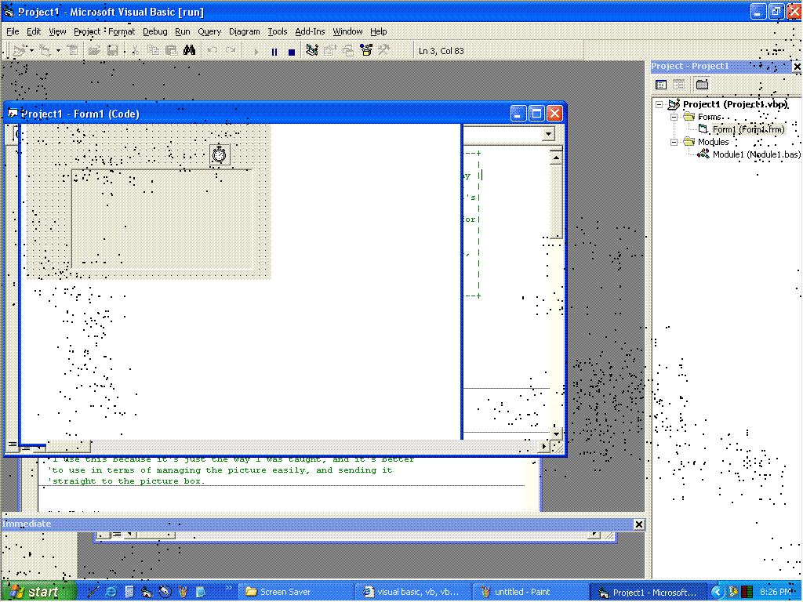



## Random Dot Screen Saver

### Description

This code basically shows a beginner how to use a screen snapshot command in applications using one methood, and a couple of things that involve picture boxes to draw dots in a random sequence.

-Later addition-

NOTICE!!! It is NOT coded to be a screen saver, it just looks like it could be one if I made it one. I noticed a comment about that, and the poster was absolutely right.
 
### More Info
 
No inputs are needed, except for clicking the mouse to terminate the program.

Not very much - I originally wrote this for my graphing calculator, so the code isn't as efficient as it could be, but it is begginer and it is efficient enough.

It returns an image of the screen when the program was launched, with little black dots appearing near each other rapidly.

The image is EXACTLY what was on your screen before! Same size and everything. This does NOT mean that you can click the icons just like normal, but that's a minor side effect, most people will be able to get past that.

             |
---                |---
**Submitted On**   |2006-11-10 20:18:06
**By**             |[High Sugar Cereal](https://github.com/Planet-Source-Code/PSCIndex/blob/master/ByAuthor/high-sugar-cereal.md)
**Level**          |Beginner
**User Rating**    |5.0 (10 globes from 2 users)
**Compatibility**  |VB 6\.0
**Category**       |[Graphics](https://github.com/Planet-Source-Code/PSCIndex/blob/master/ByCategory/graphics__1-46.md)
**World**          |[Visual Basic](https://github.com/Planet-Source-Code/PSCIndex/blob/master/ByWorld/visual-basic.md)
**Archive File**   |[Random\_Dot20312311152006\.zip](https://github.com/Planet-Source-Code/high-sugar-cereal-random-dot-screen-saver__1-67043/archive/master.zip)

